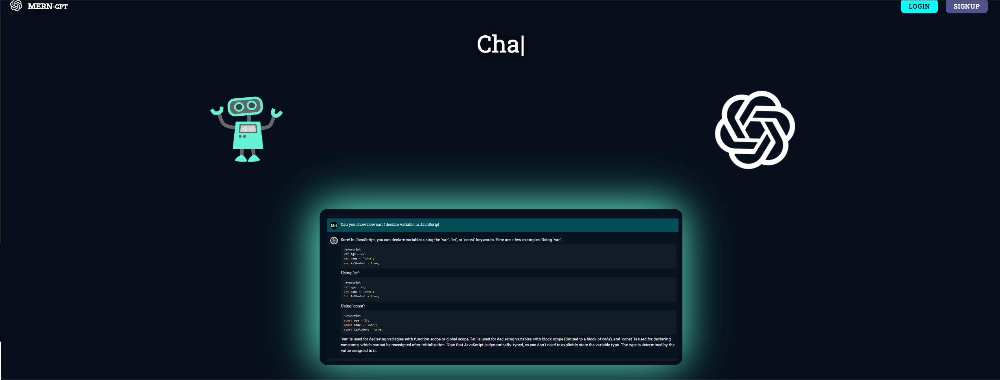
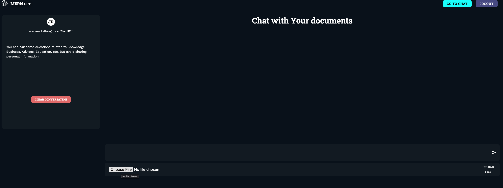
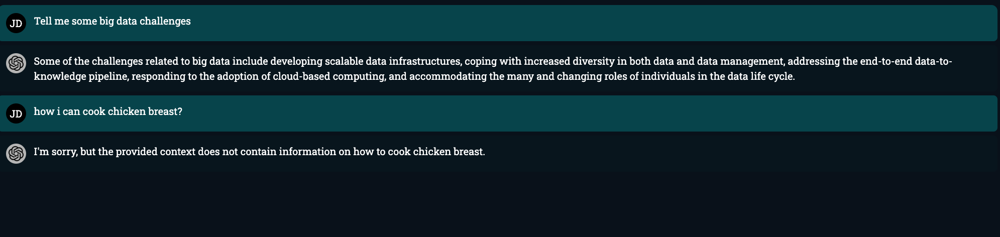

# Multi-Tenant Chatbot Architecture POC

This project is a Proof of Concept (POC) for a multi-tenant chatbot architecture. It utilizes the following technologies:

- **Qdrant Vector Database**
- **Backend**: Python with FastAPI, running on a Uvicorn server
- **Frontend**: React (using [MERN-AI-ChatBot](https://github.com/Nikhilthadani/MERN-AI-ChatBot/tree/final) for testing the backend)

## How to Run the Project

You can run the project eather locally or using Docker. The following steps will guide you through the process.

### Using Docker

1. **Clone the repository**:
    ```bash
    git clone <repository-url>
    ```
2. **Set up OpenAI API Key**:
    Add the OpenAI API key to the `.env` file in the root of the project.
    
3. **Build and Run the Docker Compose**:
    ```bash
    docker-compose up --build
    ```


1. **Clone the repository**:
    ```bash
    git clone <repository-url>
    ```

2. **Set up OpenAI API Key**:
    Export the OpenAI API key in your environment with the following name: `OPENAI_API_KEY`.

3. **Create a data folder**:
    Create a `data` folder in the root of the project.

4. **Install and Run Qdrant**:
    This will download Qdrant Docker images and run it with local file storage. The Qdrant data will be stored in the `data` folder.
    ```bash
    docker pull qdrant/qdrant
    docker run -p 6333:6333 -v $(pwd)/data:/qdrant/storage qdrant/qdrant
    ```

5. **Run the Backend**:
    ```bash
    pip install -r requirements.txt
    uvicorn main:app --reload
    ```

6. **Run the Frontend**:
    ```bash
    cd frontend
    npm install
    npm run dev
    ```

After these steps, you can access the frontend at [http://localhost:5173/](http://localhost:5173/) and the backend at [http://localhost:8000/](http://localhost:8000/). The UI will look like this:


## How to Use the Chatbot

1. **Log In**:
    Click on the login button and enter an email and a password. The password is not stored in the database, so you can use any password. The email will serve as the tenant ID in the backend.

2. **Chat Interface**:
    You will see a chat UI like this:
    

3. **Upload a PDF**:
    Use the upload button to upload a PDF file. The chatbot will extract the text from the PDF and index it in the Qdrant database.

4. **Ask Questions**:
    After uploading, you can ask questions to the chatbot. It will search for the most similar text in the Qdrant database and return answers generated by OpenAI.

Below is an example of the chatbot answering a question about the PDF file:

